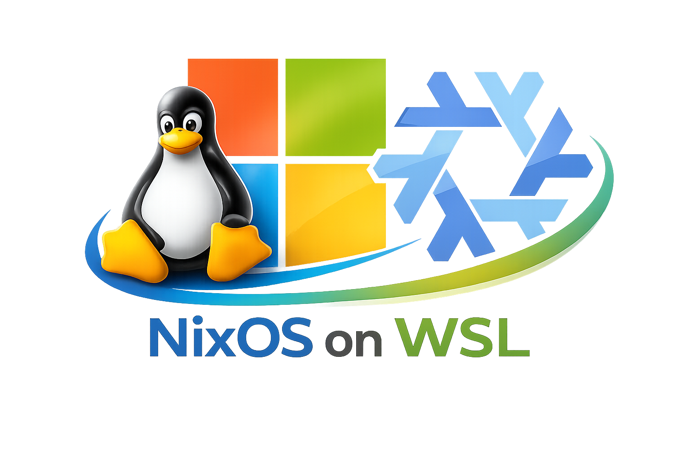

<p align="center">
  
</p>

<h1 align="center">agentic-os</h1>

<p align="center">
  <strong>An opinionated NixOS-WSL setup where AI tools are system packages, not ad-hoc installs.</strong>
</p>

<p align="center">
  <a href="https://nixos.org"></a>
  <a href="https://github.com/nix-community/NixOS-WSL"></a>
  <a href="https://www.docker.com"></a>
  <a href="#ai-tools"></a>
  <a href="LICENSE"></a>
</p>

<p align="center">
  <a href="#why">Why</a> |
  <a href="#features">Features</a> |
  <a href="#quick-start">Quick Start</a> |
  <a href="#ai-tools">AI Tools</a> |
  <a href="#architecture">Architecture</a>
</p>

---

## Why

Your dev environment shouldn't break. Your AI tools shouldn't be scattered across npm, pip, and random binaries.

```
npm install, pip install, curl | bash  -->  replaced by one flake.
```

**agentic-os** treats AI coding assistants as **first-class system dependencies** — declarative, reproducible, and update-controlled.

```bash
# New PC? One command. Same environment.
sudo nixos-rebuild switch --flake .#wsl
```

---

## Features

### AI-Native OS
- 5 AI coding agents built into the system (Claude, Gemini, Codex, OpenCode, cagent)
- Controlled updates via `nix flake update llm-agents`
- Custom derivations for tools not in nixpkgs

### Reproducibility and Safety
- Same config = same environment, guaranteed
- Instant rollback: `nixos-rebuild switch --rollback`
- Generations history for full traceability

### WSL-First Design
- Config lives on Windows filesystem — survives WSL resets
- Native Docker daemon — no Docker Desktop license needed
- VS Code Remote compatible via nix-ld

---

## Quick Start

### Prerequisites
- Windows 11 + WSL 2.4.4+
- [NixOS-WSL](https://github.com/nix-community/NixOS-WSL) installed

### Install

```bash
# Clone to Windows filesystem (resilient location)
cd /mnt/c/Users/<your-user>
git clone https://github.com/iacker/agentic-os.git
cd agentic-os

# Build your AI-native OS
sudo nixos-rebuild switch --flake .#wsl

# Reconnect for docker group
exit
```

### Verify

```bash
# Proof: AI tools are now system binaries
which claude gemini codex opencode cagent
```

---

## AI Tools

| Command | Provider | Source |
|---------|----------|--------|
| `claude` | Anthropic | llm-agents flake |
| `gemini` | Google | llm-agents flake |
| `codex` | OpenAI | nixpkgs |
| `opencode` | SST | llm-agents flake |
| `cagent` | Docker | custom derivation |

Update all AI tools:

```bash
nix flake update llm-agents
sudo nixos-rebuild switch --flake .#wsl
```

---

## Architecture

```
flake.nix                 # Entry point + inputs
├── hosts/wsl.nix         # WSL system configuration
└── modules/
    ├── ai-cli.nix        # AI agents as system packages
    ├── docker.nix        # Docker daemon with auto-prune
    ├── lazyvim.nix       # Neovim + 10 LSP servers
    ├── tools.nix         # CLI tools (git, fzf, ripgrep...)
    └── vscode.nix        # nix-ld for VS Code Remote
```

Each module is a reusable, declarative system capability.

---

## Daily Workflow

```bash
# Update AI tools only
nix flake update llm-agents
sudo nixos-rebuild switch --flake .#wsl

# Update everything
nix flake update
sudo nixos-rebuild switch --flake .#wsl

# Something broke? Rollback instantly
sudo nixos-rebuild switch --rollback

# List all generations
sudo nix-env -p /nix/var/nix/profiles/system --list-generations
```

---

## The CLAUDE.md Contract

This repo includes a `CLAUDE.md` file — instructions for AI assistants working on this codebase.

**This repo is AI-readable by design.**

It defines project structure, essential commands, and conventions so Claude Code (and other AI tools) can collaborate effectively on your system configuration.

---

## Resources

- [NixOS-WSL](https://github.com/nix-community/NixOS-WSL)
- [llm-agents.nix](https://github.com/numtide/llm-agents.nix)
- [NixOS Manual](https://nixos.org/manual/nixos/stable/)

---

## License

MIT

---

<p align="center">
  <strong>Stop configuring. Start building.</strong>
</p>
